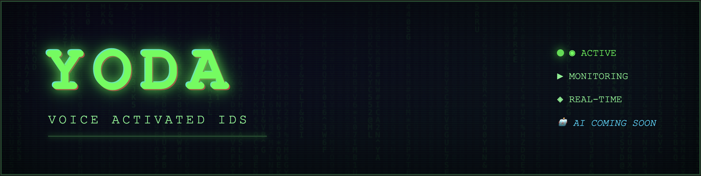

# Yoda - Voice Activated IDS



> **Formerly NetAlert-3.0**

YODA is a voice-activated **Intrusion Detection System** designed for real-time LAN monitoring. The core feature is **voice control** - use natural language commands to manage your network, including kicking devices off your network, querying the number of active devices, and requesting detailed node information. All data is visualized through a hacker-themed dashboard with live network monitoring and Matrix-style effects.

**🤖 AI-Powered (Coming Soon)** - Integrating AI for intelligent threat detection and anomaly analysis. Contributions welcome!

---

## Features

- Real-time device discovery via ARP scanning
- Hacker-themed web dashboard with Matrix effects
- Live monitoring of IP, MAC, hostname, vendor info
- Voice commands for network management
- Online/Offline tracking for all network nodes

---

## Quick Start

1. **Clone and navigate**
   ```bash
   git clone https://github.com/nsm-barii/yoda.git
   cd Yoda
   ```

2. **Setup virtual environment**
   ```bash
   python3 -m venv venv
   source venv/bin/activate
   ```

3. **Install dependencies**
   ```bash
   pip install -e .
   ```

4. **Install mpv (required for voice commands)**
   ```bash
   # Debian/Ubuntu
   sudo apt install mpv

   # Arch
   sudo pacman -S mpv
   ```

5. **Install YODA Audio System**
   ```bash
   bash install_yoda_audio.sh
   ```

6. **Download voice recognition model**
   ```bash
   cd yoda_modules
   wget https://alphacephei.com/vosk/models/vosk-model-small-en-us-0.15.zip
   unzip vosk-model-small-en-us-0.15.zip -d models/
   cd ..
   ```

7. **Run YODA**
   ```bash
   sudo ./yoda
   ```

8. **Access the dashboard**
   - The program will prompt you for:
     - **Interface** (e.g., `eth0`, `wlan0`)
     - **Subnet** (e.g., `192.168.1.0/24`)
     - **Mode** (choose **GUI**)
   - Open your browser to the URL displayed in terminal (typically `http://localhost:8000/yoda.html`)

---

## Usage

- **Auto-refresh**: Dashboard updates every 2 seconds (configurable)
- **Search & Filter**: Find nodes by IP, hostname, vendor, or MAC
- **Inspect Nodes**: Click INSPECT to view detailed device information
- **Emergency Lockdown**: Visual alert system (future: actual network blocking)

---

## Contributing

Contributions are welcome, especially for:
- AI integration for threat detection
- Automated blocking/prevention features
- Enhanced voice commands
- Port scanning integration

Submit PRs to [github.com/nsm-barii/yoda](https://github.com/nsm-barii/yoda)

---

**Built by NSM Barii** | [GitHub](https://github.com/nsm-barii/yoda) | Contributions Welcome
